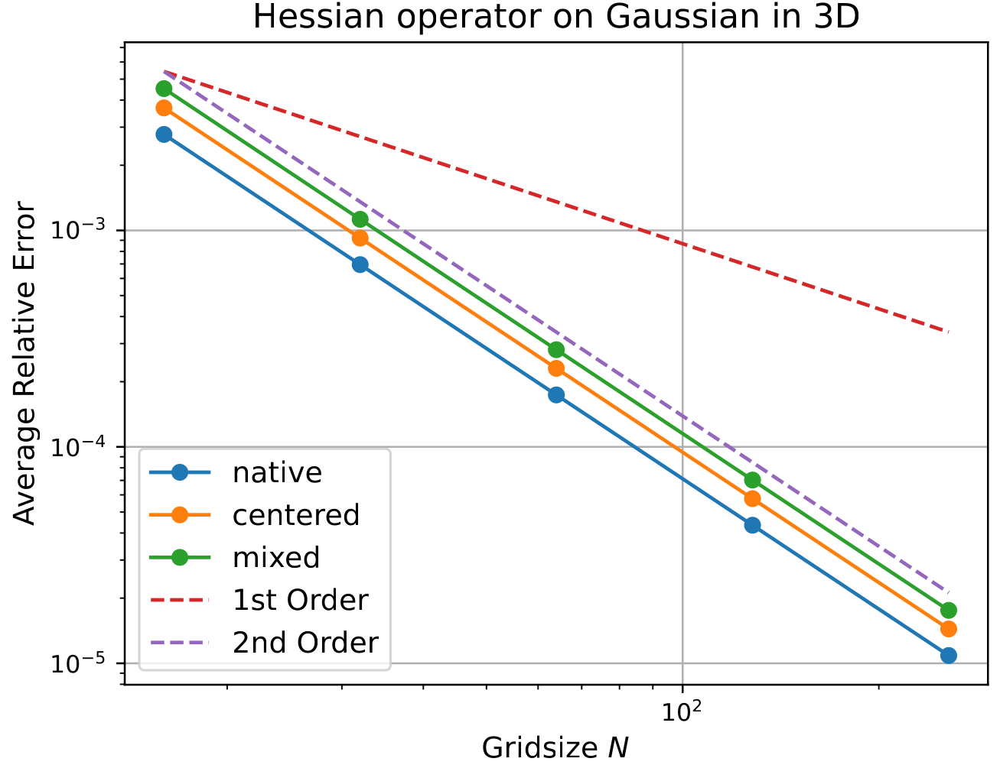
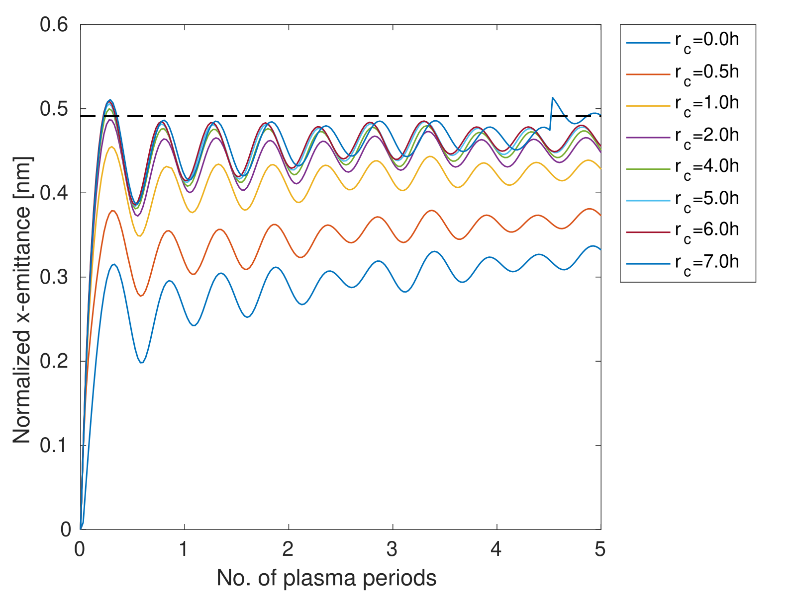

## Chainable Stencil Operators
<!--   -->
Achieves Order 2 error convergence. `mixed` being `GeneralizedHessOp<DiffType::Centered, DiffType::Forward, Difftype::Backward>(field, hInv);`

<!--  -->

---
## Resimulate DIH Problem with P3M

There can appear an unphysical peak at higher `r_cut`. This is not due to parallelization. See the serial version below:

Need to look at other spatial components of Emittance. If there is only a peak for the x-dimension there might be something wrong with the particles themselves? (Check this assertion with Sonali)