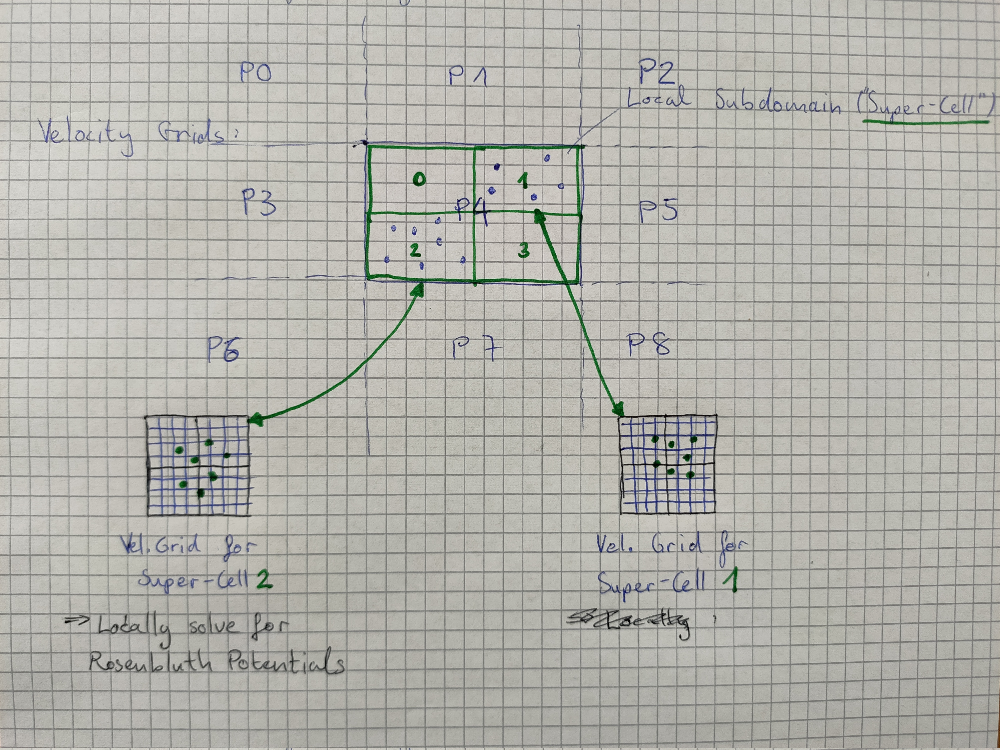

## Computing Rosenbluth Potentials Velocity Space

* Currently: One Velocity grid resolving the velocity distribution of all 156'000 particles → not accurate / inhibits parallelization

* Ideally: Would like to have a velocity distribution $f_v$ to compute the correct $F$ and $D$ for each grid cell in configuration space.

---
## Super-cells comprised of subset of **local** particles

As done in Qiang et al. (https://dl.acm.org/doi/pdf/10.5555/370049.370396)

---
## Questions:
* Can one invoke an Solvers on local grids / Fields (i.e. on the velocity grids of each super-cell)?
* Is it enough to pass `ippl::SERIAL` to the layout?